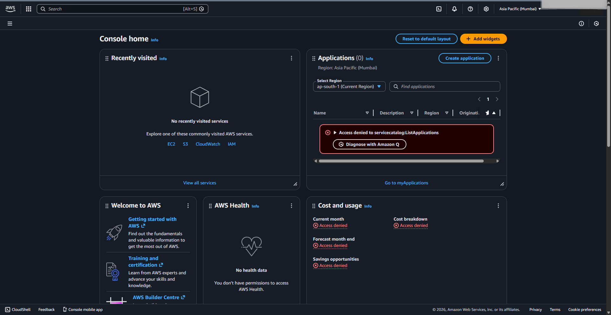

# IAM Access & Permission Troubleshooting

## 📌 Project Overview

This project demonstrates practical AWS IAM (Identity and Access
Management) troubleshooting at an AWS Cloud L1 level.\
It simulates a real-world scenario where a user is granted incorrect
permissions and encounters an **Access Denied** error.\
The issue is then diagnosed and resolved by attaching the correct
policy.

This project helps in understanding:

-   How IAM Users work
-   How IAM Policies control access
-   How to troubleshoot permission errors
-   The difference between IAM Users and IAM Roles
-   Why IAM is critical in AWS Cloud security

------------------------------------------------------------------------

# 🏗 Architecture Concept

Root User → Creates IAM User → Assigns Incorrect Policy → Access Denied\
Root User → Fixes Policy → Access Restored

------------------------------------------------------------------------

# 🚀 Step-by-Step Implementation

## ✅ STEP 1: Navigate to IAM

AWS Console → Services → IAM

------------------------------------------------------------------------

## ✅ STEP 2: Create IAM User

Path:\
IAM → Users → Create User

Configuration:

-   Username: `cloud-user`
-   Access Type: ✔ AWS Management Console access
-   Set Custom Password
-   Uncheck: "User must reset password at next sign-in"

Click **Create User**.

------------------------------------------------------------------------

## ❌ STEP 3: Attach Incorrect Permissions (Intentional Error)

Attach the following policy:

-   `AmazonS3ReadOnlyAccess`

This policy only allows viewing S3 buckets and objects.

Create the user.

------------------------------------------------------------------------

## 🔐 STEP 4: Login as IAM User

1.  Open a new browser window
2.  Use the IAM login URL generated during user creation
3.  Login with:
    -   Username: `cloud-user`
    -   Password: (custom password set earlier)

Now attempt:

Services → EC2

### ❌ Expected Result:

You will see **Access Denied** error.

### 🔍 Why This Happens:

The user only has S3 permissions.\
There are **no EC2 permissions attached**.

This is a classic IAM troubleshooting scenario.

------------------------------------------------------------------------

## 🛠 STEP 5: Fix the Access Issue

1.  Login back as Root User

2.  Navigate to: IAM → Users → cloud-user → Permissions

3.  Click **Add Permissions**

4.  Attach:

    -   `AmazonEC2ReadOnlyAccess`

Save changes.

------------------------------------------------------------------------

## ✅ STEP 6: Verify the Fix

Login again as `cloud-user`.

Navigate to:

Services → EC2

Now EC2 dashboard loads successfully.

🎉 Issue resolved.

------------------------------------------------------------------------

# 🎭 STEP 7: IAM Role Creation (Basic Understanding)

Navigate to:

IAM → Roles → Create Role

Configuration:

-   Trusted entity type: AWS Service
-   Use Case: EC2
-   Attach Policy: `AmazonS3ReadOnlyAccess`
-   Role Name: `EC2-S3-ReadOnly-Role`

Create role.

This role can now be attached to an EC2 instance to allow it to access
S3 securely.

------------------------------------------------------------------------

# 🔐 IAM User vs IAM Role (Detailed Explanation)

## 👤 IAM User

An IAM User represents a person or application that needs long-term
access to AWS.

### Characteristics:

-   Has username & password
-   Can have access keys
-   Long-term credentials
-   Used by developers or administrators
-   Requires manual permission management

### Example:

`cloud-user` created in this project.

------------------------------------------------------------------------

## 🎭 IAM Role

An IAM Role is a temporary identity assumed by AWS services or users.

### Characteristics:

-   No password
-   No long-term credentials
-   Provides temporary security credentials
-   Used by EC2, Lambda, ECS, etc.
-   More secure for service-to-service access

### Example:

`EC2-S3-ReadOnly-Role` created in this project.

------------------------------------------------------------------------

# 📊 Key Differences

  Feature          IAM User             IAM Role
  ---------------- -------------------- ------------------------
  Used By          Humans / Apps        AWS Services
  Credentials      Long-term            Temporary
  Password         Yes                  No
  Access Keys      Yes                  Temporary Only
  Best For         Console/CLI access   EC2/Lambda permissions
  Security Level   Moderate             High

------------------------------------------------------------------------

# 🔥 Why IAM is Necessary in AWS Cloud

IAM is critical because:

-   It enforces **least privilege access**
-   Prevents unauthorized access
-   Controls who can access which AWS service
-   Enables secure architecture
-   Supports enterprise-grade security compliance

Without IAM: - Every user would have full root access ❌ - High risk of
security breaches - No access control

IAM ensures structured and secure cloud operations.
