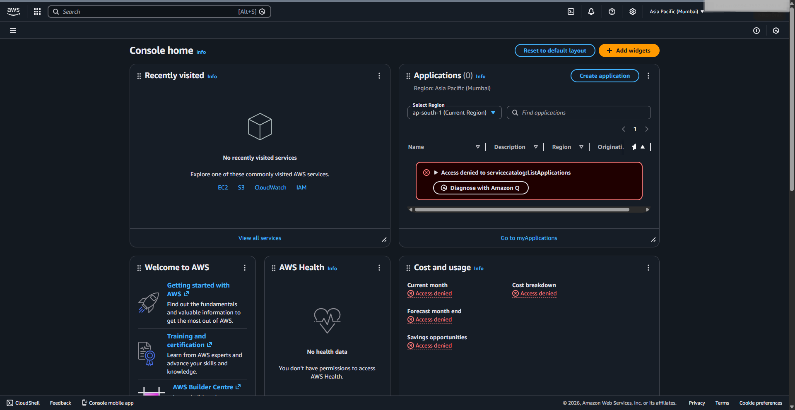

# 🔐 IAM Access & Permission Troubleshooting Lab

A hands-on AWS IAM project focused on diagnosing and resolving
real-world permission errors at a Cloud / L1 Support Engineer level.

This lab simulates a common enterprise scenario where a user is granted
incorrect permissions, encounters an **Access Denied** error, and the
issue is methodically investigated and resolved using proper IAM policy
management.

------------------------------------------------------------------------

## 📦 Technologies

-   AWS IAM (Identity and Access Management)
-   AWS Management Console
-   IAM Users
-   IAM Roles
-   IAM Policies (Managed Policies)
-   AWS EC2
-   AWS S3

------------------------------------------------------------------------

## 🦄 Features

Here's what this lab demonstrates:

-   **IAM User Creation** with console access
-   **Policy-Based Access Control**
-   **Intentional Permission Misconfiguration**
-   **Access Denied Troubleshooting**
-   **Policy Correction & Access Restoration**
-   **IAM Role Creation for Secure Service Access**
-   **Understanding Least Privilege Principle**

------------------------------------------------------------------------

## 🏗️ Architecture Concept

Root User\
↓\
Creates IAM User\
↓\
Attaches Incorrect Policy\
↓\
Access Denied\
↓\
Diagnoses Issue\
↓\
Attaches Correct Policy\
↓\
Access Restored

This project focuses on Identity & Access Management rather than
infrastructure.

------------------------------------------------------------------------

## 🚀 What You Can Do

After completing this lab, you can:

-   Create and configure IAM users
-   Attach and manage IAM policies
-   Diagnose permission-based errors
-   Understand managed vs role-based access
-   Implement least-privilege security practices
-   Differentiate IAM Users and IAM Roles clearly

------------------------------------------------------------------------

## 👩🏽‍🍳 The Process

I started by creating a new IAM user named `cloud-user` with AWS
Management Console access and a custom password.

To simulate a real-world issue, I intentionally attached:

-   `AmazonS3ReadOnlyAccess`

This policy allows viewing S3 resources but does not provide EC2
permissions.

Next, I logged in as the IAM user and attempted to access EC2.

Result: Access Denied.

Instead of randomly modifying settings, I analyzed the attached policies
and identified that no EC2 permissions were assigned.

To fix the issue:

-   Logged in as Root user
-   Navigated to IAM → Users → cloud-user
-   Attached `AmazonEC2ReadOnlyAccess`

After re-login, the EC2 dashboard loaded successfully.

This reinforced how permission boundaries directly impact service
visibility.

------------------------------------------------------------------------

## 🛠️ Troubleshooting Faced

### ❌ EC2 Access Denied

Cause: - User only had S3 Read-Only permissions - No EC2 policy attached

Fix: - Attached AmazonEC2ReadOnlyAccess policy - Verified successful
dashboard access

------------------------------------------------------------------------

## 🎭 IAM Role Creation

To understand service-level access, I created:

Role Name: `EC2-S3-ReadOnly-Role`

Configuration: - Trusted Entity: AWS Service - Use Case: EC2 - Policy
Attached: AmazonS3ReadOnlyAccess

This role can now be attached to EC2 instances to allow secure S3 access
without hardcoding credentials.

------------------------------------------------------------------------

## 📚 What I Learned

### 🔐 IAM Fundamentals

-   How managed policies control service access
-   Why least privilege is critical
-   How Access Denied errors indicate policy gaps

### 👤 IAM Users

-   Long-term credentials
-   Console and programmatic access
-   Manual permission assignment

### 🎭 IAM Roles

-   Temporary credentials
-   Assumed by AWS services
-   More secure for service-to-service communication

### 🧠 Support Mindset

Instead of guessing, I learned to:

-   Check attached policies first
-   Validate service permissions logically
-   Apply minimal required permissions
-   Re-test systematically

------------------------------------------------------------------------

## 📊 IAM User vs IAM Role (Quick Comparison)

  Feature          IAM User                IAM Role
  ---------------- ----------------------- ------------------------
  Used By          Humans / Applications   AWS Services
  Credentials      Long-term               Temporary
  Password         Yes                     No
  Access Keys      Yes                     Temporary only
  Best For         Console/CLI access      EC2/Lambda permissions
  Security Level   Moderate                Higher

------------------------------------------------------------------------

## 🔥 Why IAM is Critical in AWS

IAM is the foundation of AWS security because it:

-   Enforces least privilege access
-   Prevents unauthorized service usage
-   Enables structured enterprise security
-   Supports compliance and governance models

Without IAM, all users would effectively operate as root --- creating
major security risks.

------------------------------------------------------------------------

## 🎯 How It Can Be Improved

-   Implement custom least-privilege policy instead of managed policies
-   Test cross-account role assumption
-   Add MFA enforcement
-   Implement permission boundaries
-   Explore IAM Access Analyzer

------------------------------------------------------------------------

## 🏁 Final Result

A successfully simulated IAM permission failure scenario that
demonstrates real-world troubleshooting skills required for Cloud / AWS
L1 Support Engineer roles.

This project strengthens cloud security fundamentals and prepares for
more advanced IAM architecture and governance concepts.

------------------------------------------------------------------------

## 📸 Screenshots

